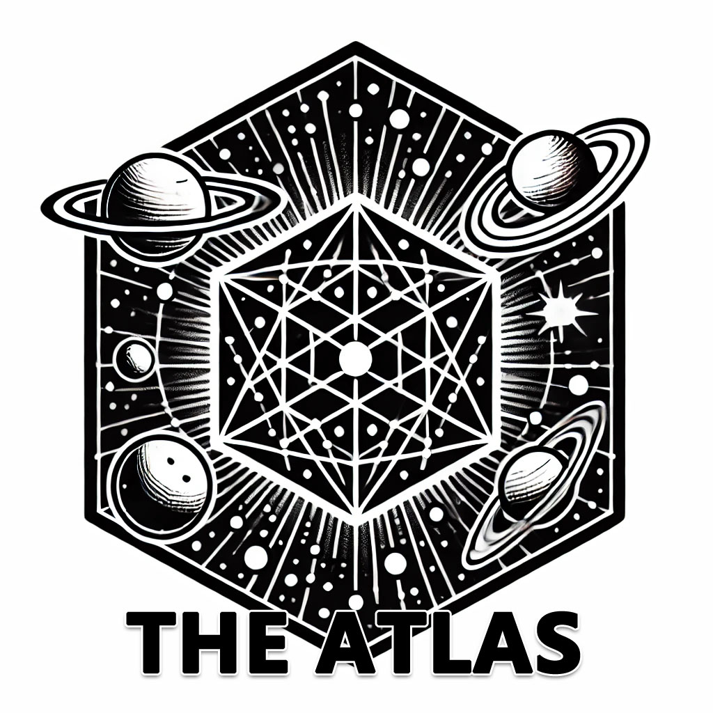
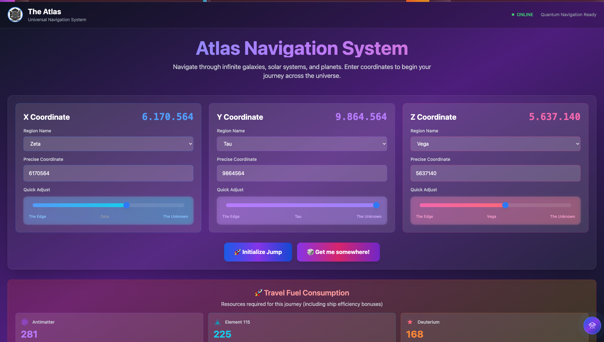
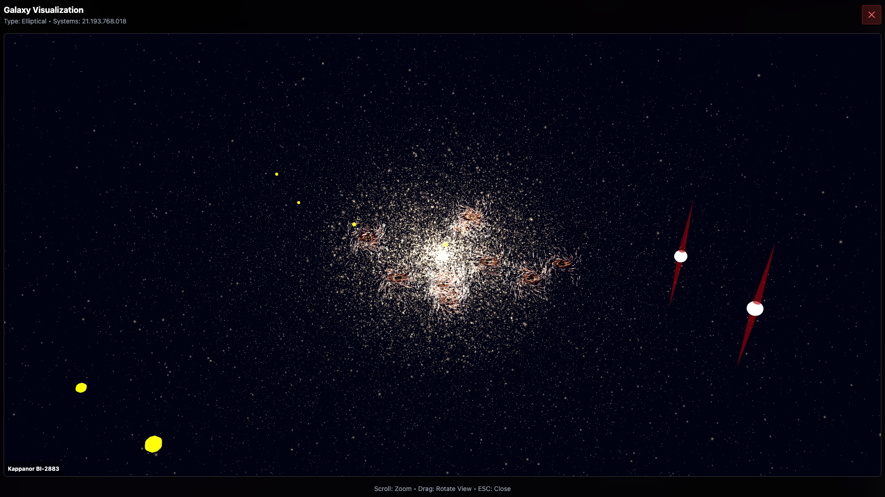
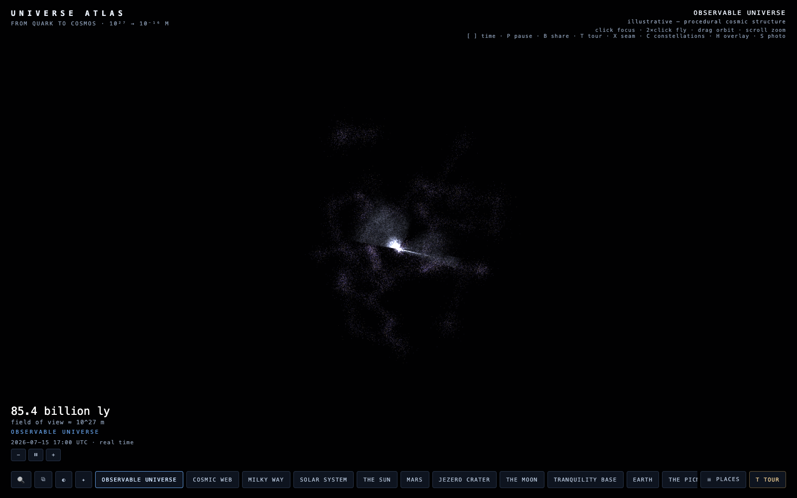

<p align="center">
  
</p>

# Pocket Universe Marvel Atlas - Interactive Pocket Dimension Reference

Pocket Universe Marvel Atlas combines a navigable pocket galaxy interface, procedural universe layouts, technical reference pages, and scalable cosmic views. The collection is organized for readers comparing pocket universe marvel concepts, pocket dimension structures, universe sandbox controls, and interactive universe atlas patterns.

[](https://pocket-universe-marvel.github.io/pocket-universe-marvel-atlas/pocket-universe-marvel)

## Start Here

| Goal | Start With | What It Contains |
| --- | --- | --- |
| Explore the interface | `src/templates/index.html` | Entry layout for cosmic navigation |
| Follow a galaxy route | `src/templates/galaxy.html` | Pocket galaxy and galaxy simulation view |
| Inspect universe states | `src/templates/multiverse.html` | Seed-oriented procedural universe flow |
| Review UI composition | `src/layouts/` | React and TypeScript screen layouts |
| Read the reference set | `docs/guide/` | Sky, interface, and astronomical chapters |
| Inspect web documentation | `docs/web/` | Handlebars pages, styles, and browser scripts |

## What Lives Here

- A TypeScript and React interface spine for galaxy, planet, system, onboarding, FAQ, and error views.
- A template set for pocket dimension navigation and universe sandbox workflows.
- Web documentation pages for properties, scripting, key bindings, and scene structure.
- Astronomical guide chapters covering the sky, interface controls, concepts, and phenomena.
- Local images for navigation, galaxy simulation, universe scale, and architecture review.



## Get The Collection

### Download Package

Use the button above to get the prepared Pocket Universe Marvel Atlas package.

### PowerShell Setup

```powershell
Expand-Archive .\pocket-universe-marvel-atlas.zip .\pocket-universe-marvel-atlas
Set-Location .\pocket-universe-marvel-atlas
Get-ChildItem
```

The extracted root contains package configuration, interface source, documentation, media, and the local logo. Node dependencies can be prepared from the same directory with `npm install`.

## Usage Routes

The project follows the goal-first documentation pattern used by its source materials. Choose a route, inspect the matching template, follow its mount point, and then review the associated layout.

| Route | Template | Mount Point | Layout |
| --- | --- | --- | --- |
| Main atlas | `src/templates/index.html` | `src/mountpoints/__main__.ts` | `src/layouts/__main__.tsx` |
| Pocket galaxy | `src/templates/galaxy.html` | `src/mountpoints/__galaxy__.ts` | `src/layouts/__galaxy__.tsx` |
| Planet | `src/templates/planet.html` | `src/mountpoints/__planet__.ts` | `src/layouts/__planet__.tsx` |
| Solar system | `src/templates/system.html` | `src/mountpoints/__system__.ts` | `src/layouts/__system__.tsx` |
| Universe sandbox | `src/templates/multiverse.html` | `src/mountpoints/__multiverse__.ts` | `src/layouts/__multiverse__.tsx` |
| Guided start | `src/templates/onboarding.html` | `src/mountpoints/__onboarding__.ts` | `src/layouts/__onboarding__.tsx` |
| Questions | `src/templates/faq.html` | `src/mountpoints/__faq__.ts` | `src/layouts/__faq__.tsx` |

### Suggested Reading Order

1. Open `docs/guide/ch_introduction.tex` for the astronomical context.
2. Continue with `docs/guide/ch_getting_started.tex` and `docs/guide/ch_interface.tex`.
3. Use `docs/web/keybinding.hbs` and `docs/web/scripting.hbs` as compact technical references.
4. Compare the templates with their TypeScript mount points and React layouts.
5. Review `docs/architecture.png` when tracing the relationship between core services, modules, and interface layers.

## Pocket Galaxy Views

The galaxy screen presents a large navigable field with visualization controls separated from the surrounding interface. This structure supports pocket galaxy exploration, galaxy simulation review, and universe sandbox interface studies without mixing the guide chapters into the rendering layer.



## Content Matrix

| Area | Format | Primary Use |
| --- | --- | --- |
| Templates | HTML | Page shells and partial composition |
| Mount points | TypeScript | Route-specific interface startup |
| Layouts | TSX | React screen assembly |
| Web reference | HBS, CSS, JS | Properties, scripts, scenes, and key bindings |
| Sky guide | TeX | Structured astronomical reading |
| Configuration | JSON, JS, MJS | TypeScript, Vite, PostCSS, and Tailwind setup |
| Media | JPG, PNG | Logo, pocket galaxy, navigation, and universe views |

## Scale And Navigation

The universe view demonstrates the continuous-scale atlas model found in the source repository material. Readers can use it as a visual companion when comparing an interactive universe atlas, a procedural universe, a pocket dimension, and a solar system 3D route.



## Topic Map

Pocket universe marvel, pocket dimension, pocket galaxy, universe sandbox, Franklin Richards pocket universe, Superman pocket universe, interactive universe atlas, galaxy simulation, procedural universe, cosmic navigation, solar system 3D, pocket universe extension.

## FAQ

### What Is The Main Entry Point?

Start with `src/templates/index.html`, then follow `src/mountpoints/__main__.ts` and `src/layouts/__main__.tsx`.

### Where Are The Pocket Dimension And Pocket Galaxy Views?

The galaxy and multiverse templates provide the closest routes. Their matching mount points and layouts keep each view isolated and easy to inspect.

### Does The Collection Include Character Databases?

The current collection concentrates on atlas interfaces, pocket universe marvel reference structure, galaxy simulation views, and astronomical documentation. Franklin Richards pocket universe and Superman pocket universe are included in the topic map for cross-reference navigation.

### How Do I Review Controls And Scripting?

Open `docs/web/keybinding.hbs` for input bindings and `docs/web/scripting.hbs` for the scripting reference. Continue with `docs/guide/ch_interface.tex` for the longer interface chapter.

### Which Files Explain The Architecture?

Use `docs/architecture.png` for the service and module overview. Use `docs/web/propertyowners.hbs`, `docs/web/propertylist.hbs`, and `docs/web/toplevel.hbs` for the web documentation hierarchy.

### Can I Change The Visual Layer?

Yes. The copied configuration includes Tailwind, PostCSS, Vite, and TypeScript settings. The route layouts under `src/layouts/` provide the clearest starting point for interface changes.

### Why Are Some Documents In TeX And Handlebars?

The collection preserves the documentation formats used by the source projects. TeX holds the long astronomical guide, while Handlebars organizes compact browser reference pages.

## Notes And Package Terms

The package metadata records the component terms used by the interface source. Documentation, configuration, templates, and media remain grouped by purpose so individual materials can be reviewed directly without external links.
